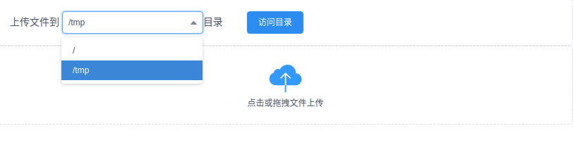
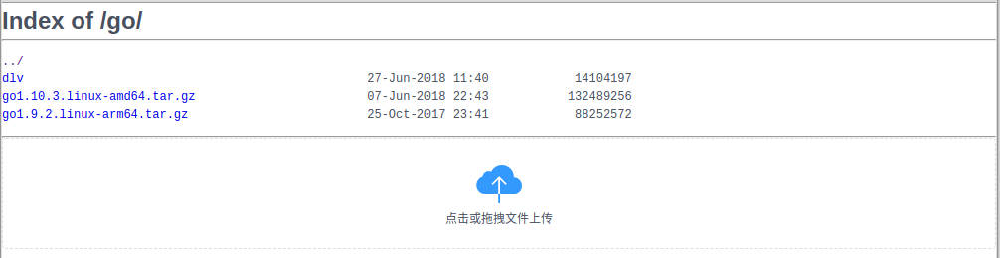

# ngx-upload-web

openresty 简单上传服务

# openresty(nginx) 配置
`/path/to/public/` 目录代指openresty(或nginx) 的公共静态文件目录, 如果使用nginx 需要安装[lua-nginx-module](https://github.com/openresty/lua-nginx-module)

- nginx.conf
```
server {
    listen       80;
    location / {
        autoindex on;
        alias /path/to/public/;
    }

    location ~ ^/_upload {
        client_max_body_size 4000m;
        content_by_lua_file /path/to/upload.lua;
    }
}
```
- upload.lua 配置数据保存目录
```
local home = "/path/to/public"
```

- upload.html 上传页面需要放到`/path/to/public` 目录, `dirs` 配置上传的子目录，需要提前创建
```
data: {
    dirs: [
        '/',
        '/tmp'
    ],
    ......
},
```

# 预览


# 扩展功能
在openresty(nginx) 返回的静态文件目录html 页面中注入上传功能代码，以便在每一个页面都能上传文件到静态目录,
需要安装[ngx_http_sub_module](http://nginx.org/en/docs/http/ngx_http_sub_module.html)

只需增加以下三行配置, 通过`sub_filter` 在`</body>` 元素前注入上传功能代码
```
sub_filter_once on;
set_by_lua_file $inject_div_before_body /path/to/inject.lua;
sub_filter '</body>' $inject_div_before_body;
```

完整示例如下：
```
server {
    listen       80;
    location / {
        sub_filter_once on;
        set_by_lua_file $inject_div_before_body /path/to/inject.lua;
        sub_filter '</body>' $inject_div_before_body;
        autoindex on;
        alias /path/to/public/;
    }

    location ~ ^/_upload {
        client_max_body_size 4000m;
        content_by_lua_file /path/to/upload.lua;
    }
}
```

# 预览
